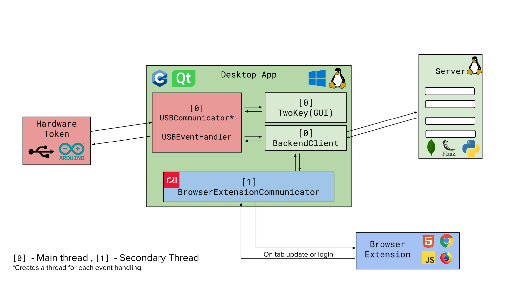

# TwoKey

TwoKey is a password manager which is relies on a USB physical access token as the second factor of authentication.

TwoKey has 4 modules:
 - The Desktop App (C/C++ and Qt)
 - The Server Backend (Python, Flask, MongoDB)
 - The Browser Extension (JS, Chrome, Firefox)
 - The Hardware Token (AVR)

The following is the general architecture of the project:

### Should I use this? 

Probably not, this is a PoC graduation project implemented in less than 4 months. While it is tested well enough to pass (academically), it 100% isn't ready to be used in production or in a real environment.

Documentation and Presentation:
 - [Documentation (PDF)](Misc./Documentation/TwoKey Documentation.pdf)
 - [Documentation (on Google Docs)](https://docs.google.com/document/d/1EKH_7GnC5Gk7F7UE59FQuZhJ4n82jdFRYTa4lHULmrA/edit?usp=sharing)
 - [Presentation (on Google Slides)](https://docs.google.com/presentation/d/15kjcTesO-ccG5K21x3QOe8d7D0Zuf3NYI-c2UDwzBeA/edit?usp=sharing)

Credits and Resources: 

 - Web server inside the desktop app: [rxi/sandbird](https://github.com/rxi/sandbird)
 - AES Encryption on the AVRs: [DavyLandman/AESLib](https://github.com/DavyLandman/AESLib)
 - Libraries for USB Detection on Linux: [libusb](https://libusb.info/) and [libudev](https://www.freedesktop.org/software/systemd/man/libudev.html)
 - A blog post on Password Manager hacking which inspired this project: [ise.io/casestudies/password-manager-hacking](https://www.ise.io/casestudies/password-manager-hacking/)
 - [CASMM by Daniel Miessler](https://danielmiessler.com/blog/casmm-consumer-authentication-security-maturity-model/)
 - [How secure is my password?](https://www.security.org/how-secure-is-my-password/)
 - [Have I been pwned?](https://haveibeenpwned.com/)

This project was implemented as a graduation project under the supervision of Dr. Karim Emara and TA/Abdulrahman Ali.
